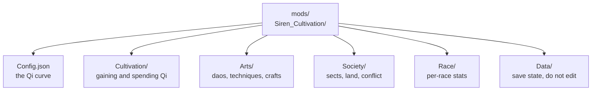

### Config

Everything the Cultivation mod can be tuned with lives under `mods/Siren_Cultivation/`, updated here for **Cultivation v0.4.1**. Rather than one enormous file, the settings are split into themed files and grouped into folders - the progression core in `Cultivation/`, everything a cultivator practices in `Arts/`, everything that only matters because other cultivators exist in `Society/`, one file per playable race in `Race/`, and the server's own runtime save state in `Data/`.

Every settings file carries its own `ConfigName` and `ConfigVersion`. The version increases automatically whenever that file's layout or balance changes, and your existing settings are migrated for you - you never need to edit `ConfigVersion` by hand, and setting it backwards only causes the migration to run again. Files also contain `Description-*` string fields, which are documentation rather than settings: the mod rewrites them to their current text on load, so editing one does nothing.

Every value on these pages can also be changed live, in game, with `/cultivation admin` instead of touching JSON at all. See the [Commands] and [Permissions] pages for how to reach it.

<br/>

* * *

<br/>

#### The folder groups

| Group: | Files: | Covers: |
|:---|:---|:---|
| [Core Config](/cultivation/config/core/) | `Config.json` | The Qi curve and the per-level health/damage bonuses. |
| [Cultivation Configs](/cultivation/config/cultivation/) | `SpiritCoreConfig`, `SpiritVeinConfig`, `BreakthroughConfig`, `RaceSystemConfig`, `SkillTreeConfig` | Where Qi comes from, what advancing costs, and what a rank-up pays out. |
| [Arts Configs](/cultivation/config/arts/) | `DaoConfig`, `TechniqueConfig`, `ManualConfig`, `AlchemyConfig`, `RefinementConfig`, `LifeBoundConfig`, `BeastConfig` | What a cultivator practices, crafts, tempers, and binds to themselves. |
| [Society Configs](/cultivation/config/society/) | `SectConfig`, `FormationConfig`, `DwellingConfig`, `WarConfig`, `DuelConfig` | Sects, the ground they hold, the homes they build, and the fights they pick. |
| [Race Configs](/cultivation/config/race/) | `Human.json`, `Demon.json`, `Deity.json` | One independent stat file per playable race. |
| [Data Files](/cultivation/config/data/) | `SectsData`, `FormationsData`, `WarsData`, `DwellingsData`, `LeaderboardData` | Runtime save state. Not settings - do not hand-edit these. |

<br/>

* * *

<br/>

#### Folder layout

```
mods/Siren_Cultivation/
├── Config.json
├── Cultivation/
│   ├── SpiritCoreConfig.json
│   ├── SpiritVeinConfig.json
│   ├── BreakthroughConfig.json
│   ├── RaceSystemConfig.json
│   └── SkillTreeConfig.json
├── Arts/
│   ├── DaoConfig.json
│   ├── TechniqueConfig.json
│   ├── ManualConfig.json
│   ├── AlchemyConfig.json
│   ├── RefinementConfig.json
│   ├── LifeBoundConfig.json
│   └── BeastConfig.json
├── Society/
│   ├── SectConfig.json
│   ├── FormationConfig.json
│   ├── DwellingConfig.json
│   ├── WarConfig.json
│   └── DuelConfig.json
├── Race/
│   ├── Human.json
│   ├── Demon.json
│   └── Deity.json
└── Data/
    ├── SectsData.json
    ├── FormationsData.json
    ├── WarsData.json
    ├── DwellingsData.json
    └── LeaderboardData.json
```

<br/>

* * *

<br/>

#### Where to start



[Commands]: /cultivation/commands/
[Permissions]: /cultivation/permissions/
