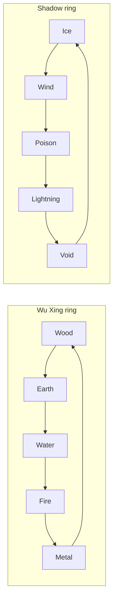

### The Dao

Open your Dao page with `/cultivation dao`. It holds two tracks that run side by side: the **Elemental Dao (五行道)** you deliberately choose, and the **Yin-Yang balance** your deeds quietly write for you.

The elemental half unlocks at **Foundation Establishment** (`Dao-Unlock-Realm`). Your first choice is free. The Yin-Yang half is live from the very start unless a server sets `YinYang-Endgame-Only`, which hides and suspends it until `YinYang-Unlock-Realm` (Nascent Soul).

 

* * *

 

#### The Ten Elements

Five classic Wu Xing elements form one ring, and five shadow elements form another. Each element **overcomes** the next in its own ring, wrapping around. Cross-ring matchups are neutral - a Fire cultivator has no elemental edge over a Poison one either way.

An arrow reads "overcomes". Wood overcomes Earth, Earth overcomes Water, and so on around the ring; Ice overcomes Wind, Wind overcomes Poison, and so on around the shadow ring.

Every element maps to a real damage type. Fire, Ice and Poison use vanilla causes; Wood, Earth, Water, Metal, Wind, Lightning and Void are damage assets this mod ships, all inheriting the engine's Elemental cause.

 

* * *

 

#### Damage Conversion and the Counter Cycle

Once you walk a dao, your outgoing melee damage is converted to that element's damage type and adjusted:

| Variable Name: | Default Value: | Description: |
|:---|:---|:---|
| `Dao-Damage-Bonus-Percent` | 10 | Flat bonus on any converted strike. |
| `Dao-Counter-Bonus-Percent` | 15 | Extra damage against a defender whose element yours overcomes. |
| `Dao-Counter-Penalty-Percent` | 10 | Less damage against the element that overcomes yours. |
| `Dao-Wood-Heal-Percent-Of-Damage` | 20 | Wood's alternative to the flat bonus. |

**Wood is the healing path.** It takes no flat damage bonus at all - instead you are healed for 20% of the damage you deal. The counter bonuses still apply normally.

A cultivator with no dao at all is not left out: a [refined weapon](/cultivation/refinement/) supplies its own element for conversion and the counter cycle, and when that element matches its wielder's own dao it adds a resonance bonus on top. [Techniques](/cultivation/techniques/) that deal damage route through the same filter, so Sword Qi Slash and Nine Heavens Thunder Palm are recoloured by your dao for free.

#### Switching, and Drift

Switching dao deliberately costs banked Qi and honours a real-time cooldown:

| Variable Name: | Default Value: | Description: |
|:---|:---|:---|
| `Dao-Switch-Base-Qi-Cost` | 500 | Base Qi cost of a switch. |
| `Dao-Switch-Qi-Cost-Realm-Multiplier` | 1.6 | Multiplied per realm reached. |
| `Dao-Switch-Cooldown-Hours` | 24 | Real-world hours between deliberate switches. |

Your dao can also **drift** on its own. Every elemental kill feeds `Dao-Affinity-Per-Elemental-Kill` (1) into the hidden affinity of the killing blow's element, and your race's alignment bias feeds it too. When another element's affinity exceeds your chosen dao's by `Dao-Drift-Margin` (25) you get a warning; if it keeps growing past twice the margin, your dao converts on its own - no Qi cost, no cooldown. Set `Dao-Drift-Enabled` false to freeze daos to deliberate choices only.

 

* * *

 

#### Yin-Yang Balance

Every cultivator carries a Yin-Yang balance that moves with what they do:

- **Meditation** shifts it by `Meditation-Alignment-Shift-Per-Tick` (0.2) per drain tick - toward Yang on a good chunk, toward Yin on an evil one. 5% of chunks (`Chunk-Evil-Qi-Chance`) carry evil qi.
- **Your race** skews that shift by its own `Qi-Alignment-Yin-Bias-Percent` - a Demon at +50% darkens even good qi, a Deity at -30% purifies dark qi. See [Races](/cultivation/races/).
- **Killing** adds `Kill-Yin-Amount` (1) Yin per kill, multiplied by `Night-Kill-Yin-Multiplier` (2) when the world is in its night phase. Slaughter under darkness stains deepest.

Where you sit on that scale decides what you get:

| State: | Effect: |
|:---|:---|
| Balanced - within `Balance-Window-Percent` (15%) of a 50/50 split | `Balance-Bonus-Percent` (10%) to **all** Qi gain and damage, fading linearly toward the window's edge. |
| Deep Yin - past `Lean-Threshold-Percent` (70%) Yin share | `Yin-Power-Damage-Percent` (+10%) damage and `Yin-Lifedrain-Percent` (5%) of damage dealt returned as health. |
| Deep Yang - past the same threshold of Yang share | `Yang-Defense-Percent` (10%) incoming-damage reduction and `Yang-Heal-Bonus-Percent` (+25%) to healing you receive, Wood strikes included. |

Balance and lean are mutually exclusive by construction: you cannot be both perfectly centred and deeply leaned. Choosing which to chase is the real decision of the system.

 

* * *

 

#### The Devil and Righteous Paths

Lean far enough and the balance stops being a stat and becomes a **path**. Path is never chosen - it follows the deeds, and it shifts back when they do. Your Dao page shows the one you currently walk, and you are told in chat when it changes.

| Path: | Trigger: | Perks: |
|:---|:---|:---|
| **Devil Path (魔道)** | Yin lean fraction at or past `Path-Lean-Fraction-Threshold` (0.5) | `Path-Devil-Damage-Vs-Righteous-Percent` (+15%) against Righteous cultivators, and `Path-Devil-PK-Qi-Reward` (100) banked Qi harvested for slaying any player. |
| **Righteous Path (正道)** | Yang lean fraction at or past the same threshold | `Path-Righteous-Damage-Vs-Devil-Percent` (+15%) against Devils, and `Path-Righteous-Defense-Vs-Devil-Percent` (15%) less damage taken from them. |
| **Unaligned** | anything short of the threshold | The mortal middle road - no path perks, but the balance bonus is easiest to hold here. |

The Devil Path's Qi harvest is rate-limited so it cannot be farmed. Killing the same victim again within `Pk-Same-Victim-Cooldown-Seconds` (900) pays nothing, and killing anyone whose realm index is below `Pk-Min-Victim-Realm` (1) pays nothing regardless. Both gates cover the dao deeds and the [manual](/cultivation/manuals/) drop roll as well as the Qi. Normal PvP is untouched - only the cultivation spoils are gated.

A farmed kill is not merely unrewarded: it charges more [karma](/cultivation/karma/) than an honest one, and a Devil accrues karma faster than anyone. The heavens collect at your next [tribulation](/cultivation/tribulations/).

A deep lean in either direction also changes what a breakthrough looks like: past `HeartDevil-Lean-Threshold` (0.5) you face the **Heart-Devil Trial (心魔劫)** instead of tribulation lightning.

| Command: | Description: | Permission: |
|:---|:---|:---|
| `/cultivation dao` | Open the Dao page - element, affinities, balance, path and karma. | `cultivation` |
| `/cultivation bonuses` | Every bonus currently applying to you, dao included. | `cultivation` |

Every value on this page lives in the Dao config - see [Config](/cultivation/config/arts/) - and the commands are on the [Commands](/cultivation/commands/) page.
