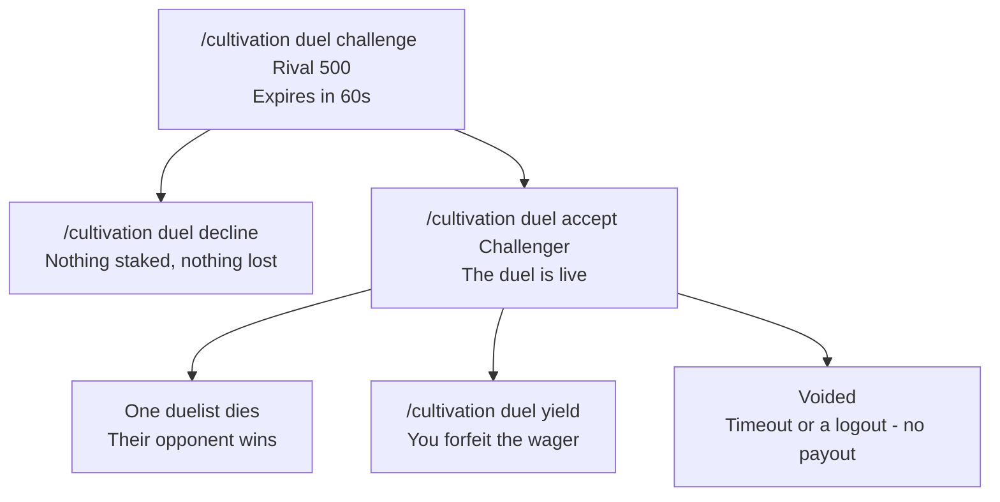

### Duels

A **duel** is a consensual 1v1 between two cultivators with banked Qi staked on the outcome. Both sides opt in, the loser forfeits their Qi to the winner, and the transfer conserves Qi exactly - nothing is created.

Gated behind `Duels-Enabled` (default `true`).

 

* * *

 

#### Challenge and Accept

- `/cultivation duel challenge <player> [wager]` stakes that much of your banked Qi and challenges them. Omit the wager, or type something that is not a number, and it is treated as **0** - an honour duel with nothing on the line.
- The challenge expires after **60 seconds** if it goes unanswered (`Duel-Challenge-Expiry-Seconds`).
- `Duel-Max-Wager` caps the stake. It is **0 by default, meaning uncapped**; any positive value is a ceiling, and a challenge above it is refused.
- `/cultivation duel accept <player>` accepts that player's pending challenge and the duel begins at once. Both duelists are told the stake.
- `/cultivation duel decline <player>` throws the challenge away.
- Neither player may be in another duel - one duel at a time, on both sides.

Duels are **never persisted**. A server restart voids anything in flight.

 

* * *

 

#### Deciding a Duel

A duel ends in one of three ways.

**By death.** The duel is decided by one duelist *dying*, not by who struck them. The opponent wins whether they landed the blow themselves, their [Spirit Beast](/cultivation/beasts/) did, a third party interfered, or the loser simply drowned. Anything narrower would leave duels that can never resolve.

**By yielding.** `/cultivation duel yield` (alias `forfeit`) ends it immediately and pays the wager to your opponent.

**Voided.** No Qi changes hands at all when a duel becomes undecidable:

- Either participant logs out.
- The duel runs past **600 seconds** (`Duel-Max-Duration-Seconds`; `0` disables the timeout). This is the backstop against an opponent who simply walks away and never fights.

Whoever is still online is told the duel was called off.

 

* * *

 

#### The Payout

The loser forfeits **up to** the wager in banked Qi, and the winner gains **exactly what the loser actually forfeited**. If the loser could not cover the full stake, the winner receives only what was really there - a duel is never a Qi faucet. A participant who is offline when the payout resolves is skipped, and since a skipped loser forfeits nothing, the winner gains nothing either.

The Qi moves off your banked total; it does not touch your realm or stage. See [Cultivation Realms] for what banked Qi is spent on.

 

* * *

 

#### Duels on a PvP-Disabled World

`Duel-Overrides-World-Pvp` is **new in v0.4.1** and defaults to `true`.

Normally a world with `IsPvpEnabled` set to false cancels all player-versus-player damage, which would leave a duel decidable only by yielding. Since a duel is explicit, mutual, staked consent, Cultivation re-permits exactly that damage - and only that damage:

- Only between the two duelists, only while their duel is live.
- Only when the world's PvP flag was demonstrably the sole reason the hit was cancelled. If PvP is actually enabled there, the cancellation came from something else and is left alone.
- Never through spawn protection, invulnerability, intangibility, a player already dead, or a world with incoming player damage switched off entirely.
- The revived hit still runs through all of Cultivation's own damage filters afterwards, so realm scaling, [Dao](/cultivation/dao/) conversion, Life-Bound and technique effects all apply as usual.

Set it to `false` to make the world's PvP rule absolute - in which case a duel on such a world can only be settled by `/cultivation duel yield`.

 

* * *

 

#### Commands

| Command: | Description: | Permission: |
|:---|:---|:---|
| `/cultivation duel challenge <player> [wager]` | Stakes banked Qi and challenges another cultivator. | `cultivation` |
| `/cultivation duel accept <player>` | Accepts that player's pending challenge. | `cultivation` |
| `/cultivation duel decline <player>` | Declines that player's pending challenge. | `cultivation` |
| `/cultivation duel yield` | Forfeits your current duel; the wager goes to your opponent. | `cultivation` |

 

* * *

 

`Duels-Enabled`, `Duel-Challenge-Expiry-Seconds`, `Duel-Max-Wager`, `Duel-Overrides-World-Pvp` and `Duel-Max-Duration-Seconds` all live in the society config - see [Society Config] for the full field reference, and [Commands] for every command in the mod. For the other ways cultivators come to blows, see [Sect Wars] and [Sects].

[Cultivation Realms]: /cultivation/realms/
[Sect Wars]: /cultivation/wars/
[Sects]: /cultivation/sects/
[Society Config]: /cultivation/config/society/
[Commands]: /cultivation/commands/
