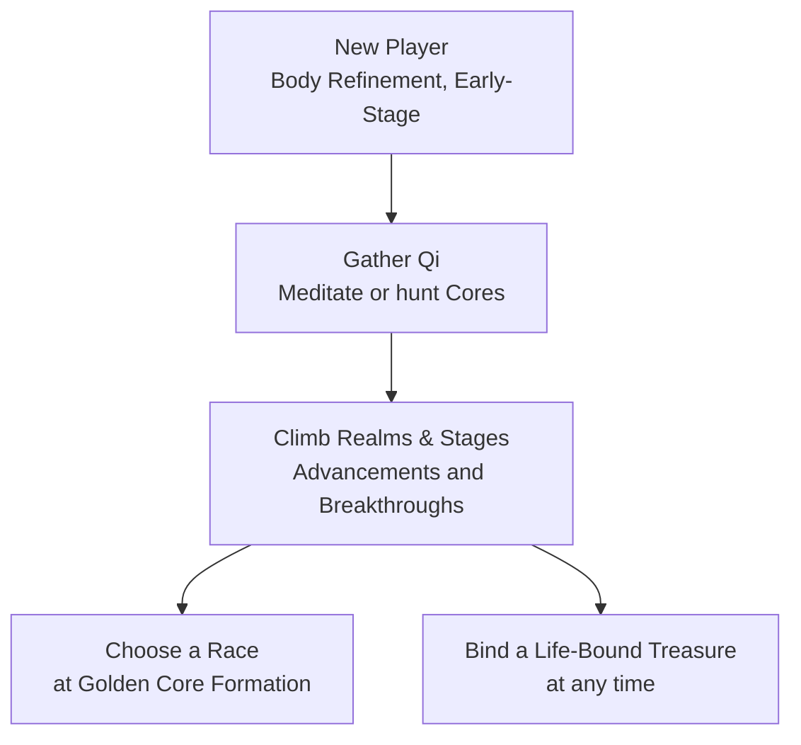

### Welcome to the Official [Cultivation] Mod Wiki!

Ever wanted to walk the path of a Xianxia cultivator? Now you can with **Cultivation**, a full Xianxia-style leveling system for your server. Meditate to draw ambient Spirit Qi from the world around you, hunt creatures for cultivation cores, climb seven realms of power on your way toward immortality, choose a race once you're strong enough, and bind your own weapons and armor to your soul so they grow stronger the more you use them.

#### Features:

- Works in Singleplayer and Multiplayer.
- Climb 7 [Cultivation Realms], each with 4 sub-stages - both sub-stage advancements and realm breakthroughs are real, timed meditation rituals with a real risk of failure.
- [Meditate](/cultivation/qi-gathering/) to pull ambient Qi from your chunk's Spirit Vein, a real per-chunk energy pool that depletes and regenerates over time.
- Hunt creatures for a chance at Spirit, Profound, or Divine [Cultivation Cores](/cultivation/qi-gathering/) - absorb them instantly, or mid-meditation for a bonus.
- Choose a [Race](/cultivation/races/) - Human, Demon, or Deity - once you reach Golden Core Formation, each with its own server-tunable bonuses.
- Bind any weapon or armor piece into a [Life-Bound Treasure] that levels up from combat.
- Persistent, toggleable HUD showing your realm, stage, Qi, and ritual progress at a glance.
- Live in-game admin config editor - retune the entire mod without ever opening a JSON file.
- Every number in the mod lives in a themed config file - nothing is hardcoded.
- Fully localized: English, Portuguese (Brazil), Russian, Ukrainian, and Simplified Chinese, with proper Xianxia terminology throughout.

[](/cultivation/hstats/)

* * *

#### Learn the System

- [Cultivation Realms] - the 7-realm, 4-stage progression ladder, and how advancements/breakthroughs work.
- [Qi Gathering](/cultivation/qi-gathering/) - meditation, Spirit Veins, and Spirit/Profound/Divine Cores.
- [Races](/cultivation/races/) - Human, Demon, and Deity, and how to unlock them.
- [Life-Bound Treasure] - personalize a weapon or armor piece so it grows stronger the more you use it.
- [Commands](/cultivation/commands/), [Config](/cultivation/config/), and [Permissions](/cultivation/permissions/) - the full reference pages.

* * *

#### All platforms the Cultivation mod is uploaded onto:

- [Curseforge]
- [Modifold]

[Cultivation]: /cultivation/curseforge/
[Curseforge]: /cultivation/curseforge/
[Modifold]: /cultivation/modifold/
[Cultivation Realms]: /cultivation/realms/
[Life-Bound Treasure]: /cultivation/lifebound/
