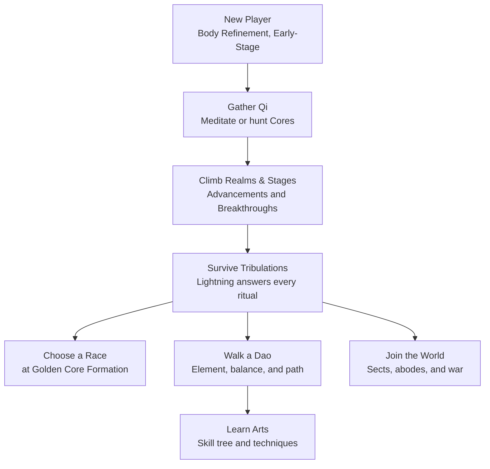

### Welcome to the Official [Cultivation] Mod Wiki!

Ever wanted to walk the path of a Xianxia cultivator? Now you can with **Cultivation**, a full Xianxia-style progression system for your server. Meditate to draw ambient Spirit Qi from the world around you, hunt creatures for cultivation cores, climb seven realms of power on your way toward immortality, survive the heavenly tribulation that answers every breakthrough, master an element of the Dao, found a sect, and take a rival's mountain by siege.

These docs cover **Cultivation v0.4.1**.

#### Features:

- Works in Singleplayer and Multiplayer.
- Climb 7 [Cultivation Realms], each with 4 sub-stages - both sub-stage advancements and realm breakthroughs are real, timed meditation rituals with a real risk of failure.
- [Meditate](/cultivation/qi-gathering/) to pull ambient Qi from your chunk's Spirit Vein, a real per-chunk energy pool that depletes and regenerates over time - and hunt creatures for Spirit, Profound, and Divine Cores.
- Survive [Tribulations](/cultivation/tribulations/) - lightning falls on your ritual, and a deeply unbalanced cultivator faces the Heart-Devil Trial instead.
- Choose a [Race](/cultivation/races/), spend skill points across a nine-branch [Skill Tree](/cultivation/skilltree/), and pick your element of [the Dao](/cultivation/dao/).
- Learn active [Techniques](/cultivation/techniques/) from lootable [Manuals](/cultivation/manuals/) - fly on your sword, cross a valley in one step, or call down a thunder palm.
- Temper your weapons in tribulation lightning with [Weapon Refinement](/cultivation/refinement/), brew pills with [Alchemy](/cultivation/alchemy/), and bind a [Life-Bound Treasure] that levels up from combat.
- Tame or hatch [Spirit Beasts](/cultivation/beasts/) that cultivate their own realm alongside you.
- Found a [Sect](/cultivation/sects/) with elders and join policies, claim a hall on a dragon vein, carve an art into it for every disciple, raise [Formations](/cultivation/formations/), and settle scores through [Sect Wars](/cultivation/wars/) or a wagered [Duel](/cultivation/duels/).
- Claim a [Cave Abode](/cultivation/dwelling/) whose Spirit Spring keeps filling while you are logged off.
- Every kill you take from another cultivator writes [Karma](/cultivation/karma/) the heavens collect at your next tribulation.
- Persistent, toggleable HUD, and a live in-game admin config editor - retune the entire mod without ever opening a JSON file.
- Every number in the mod lives in a themed [config](/cultivation/config/) file - nothing is hardcoded.
- A public [Cultivation API](/cultivation/api/) with roughly 135 events, so other mods can watch, veto, or re-tune almost anything Cultivation does.
- Localized in English and Simplified Chinese with proper Xianxia terminology throughout, plus partial translations for Portuguese (Brazil), Russian, and Ukrainian.

[](/cultivation/hstats/)

* * *

#### Learn the System

 

* * *

 

#### Progression

- [Cultivation Realms] - the 7-realm, 4-stage progression ladder, and how advancements and breakthroughs work.
- [Qi Gathering](/cultivation/qi-gathering/) - meditation, Spirit Veins, weather resonance, and Spirit/Profound/Divine Cores.
- [Tribulations](/cultivation/tribulations/) - the lightning that answers a ritual, and the Heart-Devil Trial.
- [Races](/cultivation/races/) - Human, Demon, and Deity, and how to unlock them.
- [Skill Tree](/cultivation/skilltree/) - nine branches of nodes bought with skill points.
- [Karma](/cultivation/karma/) - the ledger the heavens keep on every cultivator you kill.

#### Arts

- [The Dao](/cultivation/dao/) - the elements, the Wu Xing counters, Yin-Yang balance, and the Devil/Righteous path split.
- [Techniques](/cultivation/techniques/) - active arts, from sword flight to the thunder palm.
- [Manuals](/cultivation/manuals/) - the lootable books that teach them.
- [Weapon Refinement](/cultivation/refinement/) - temper a weapon in tribulation lightning.
- [Alchemy](/cultivation/alchemy/) - pills and what they do.
- [Life-Bound Treasure] - personalize a weapon or armor piece so it grows stronger the more you use it.
- [Spirit Beasts](/cultivation/beasts/) - companions that cultivate their own realm.

#### Society

- [Sects](/cultivation/sects/) - guilds with elders, join policies, halls, and hall inscriptions.
- [Sect Wars](/cultivation/wars/) - declare war and take a rival's mountain by siege.
- [Formations](/cultivation/formations/) - chunk-anchored spirit arrays that buff, ward, or trap.
- [Cave Abodes](/cultivation/dwelling/) - a claimed dwelling with a Spirit Spring that fills while you are away.
- [Duels](/cultivation/duels/) - settle it one on one, with Qi on the line.

#### Reference

- [Commands](/cultivation/commands/), [Config](/cultivation/config/), and [Permissions](/cultivation/permissions/) - the full server-owner reference.
- [Cultivation API](/cultivation/api/) - events, registries, and the facade other mods build on.

* * *

#### All platforms the Cultivation mod is uploaded onto:

- [Curseforge]
- [Modifold]

[Cultivation]: /cultivation/curseforge/
[Curseforge]: /cultivation/curseforge/
[Modifold]: /cultivation/modifold/
[Cultivation Realms]: /cultivation/realms/
[Life-Bound Treasure]: /cultivation/lifebound/
