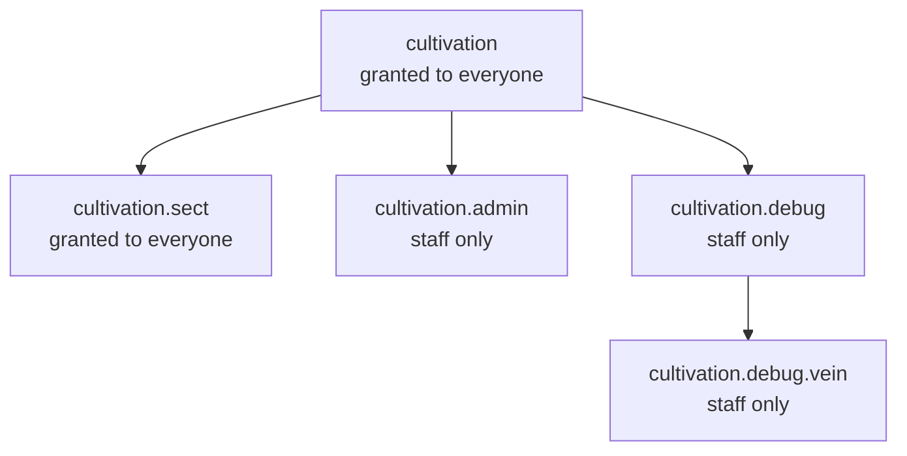

### Permissions

The mod declares five permission nodes. Every command in the mod sits behind one of them - see
[Commands](/cultivation/commands/) for which command needs which.

| Permission: | Description: |
|:---|:---|
| cultivation | The `/cultivation` root and every player-facing subcommand under it - info, bind, meditate, hud, settings, race, skilltree, dao, technique, refine, respec, bonuses, formations, abode, beast, duel, top. |
| cultivation.sect | The `/sect` root and every sect subcommand, including `/sect war` and `/sect top`. The same suite reached through `/cultivation sect ...` uses this node too. |
| cultivation.admin | The `/cultivation admin` config editor UI and all eight of its player-modifying subcommands. |
| cultivation.debug | The `/cultivation debug` command group. |
| cultivation.debug.vein | `/cultivation debug vein`. |

 

* * *

 

#### Hierarchy

The node names are dotted, and that dotting mirrors the command tree - `cultivation` is the root,
`cultivation.sect`, `cultivation.admin` and `cultivation.debug` sit under it, and
`cultivation.debug.vein` sits under the debug group. Each command requires its own node explicitly,
so holding `cultivation` does not by itself confer `cultivation.admin`.

 

* * *

 

#### What is granted by default

`cultivation` and `cultivation.sect` are both registered to the `hytale:None` group - the default
group every player belongs to - so the whole player-facing experience, cultivating and sects alike,
works out of the box with no permission setup.

`cultivation.admin`, `cultivation.debug` and `cultivation.debug.vein` are granted to nobody by
default. They are deliberately registered with an empty permission-group list rather than left
unset: an unset list falls back to the parent command's groups, which would silently hand the admin
menu to every player through `hytale:None`. Server staff still reach them the normal way, through
the wildcard on their own admin group.
