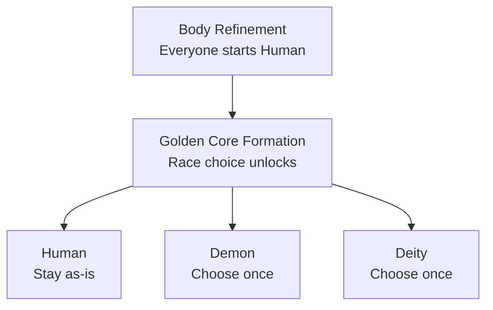

### Races

Every player starts as **Human**. Reaching **Golden Core Formation** unlocks a one-time choice to become **Demon** or **Deity** instead (or stay Human), made through a dedicated race menu (`/cultivation race`) that shows each race's live, config-driven bonuses before you pick. Used your one choice already? An admin can grant more with `/cultivation admin grantracechoice`.

Each race grants its own bonuses to max health, damage, Qi gain rate and breakthrough speed, and its own Yin bias on the qi it absorbs. Every value is rebalanceable without recompiling, and the bonuses shown in-game are always the live, current ones.

#### Available Races

| Race: | Unlock Realm: | Health: | Damage: | Qi Gain: | Breakthrough Speed: | Yin Bias: |
|:---|:---|:---|:---|:---|:---|:---|
| [Human](/cultivation/races/human/) | Body Refinement | +0% | +0% | +10% | +0% | 0% |
| [Demon](/cultivation/races/demon/) | Golden Core Formation | -10% | +25% | -10% | +0% | +50% |
| [Deity](/cultivation/races/deity/) | Golden Core Formation | +20% | -10% | +5% | 20% faster | -30% |

**Yin bias** (`Qi-Alignment-Yin-Bias-Percent`) skews how meditated qi lands on your Yin-Yang balance: a Demon at +50% turns half of what would have been Yang into Yin instead, a Deity at -30% purifies 30% of would-be Yin into Yang. It is the single largest nudge toward the Devil or Righteous path - see [The Dao](/cultivation/dao/).

By default an admin using `/cultivation admin setrace` (or the admin UI's Set Race action) can bypass a race's unlock-realm requirement entirely - set `Race-Admin-Bypasses-Realm-Gate` to false to hold admin overrides to the normal gate too.

 

* * *

 

#### An Open Registry

Races are no longer a closed list. Another mod can register a brand-new race through `CultivationAPI.registerRace`, backed by its own config file or a plain constant, and it shows up in the race menu right alongside Human, Demon and Deity - with its own unlock realm, its own bonuses and its own Yin bias. Built-in and third-party races run through exactly the same code path. See [Registries](/cultivation/api/registries/) for how to add one.

| Command: | Description: | Permission: |
|:---|:---|:---|
| `/cultivation race` | Open the race selection menu. | `cultivation` |
| `/cultivation admin setrace` | Force a player's race. | `cultivation` |
| `/cultivation admin grantracechoice` | Give a player another race choice. | `cultivation` |

Per-race values live in one config file per race - see [Race Configs](/cultivation/config/race/) - while the cross-race server behaviour sits in `Cultivation/RaceSystemConfig.json`, on the [Cultivation Configs](/cultivation/config/cultivation/) page. The commands above are documented in full on the [Commands](/cultivation/commands/) page.
