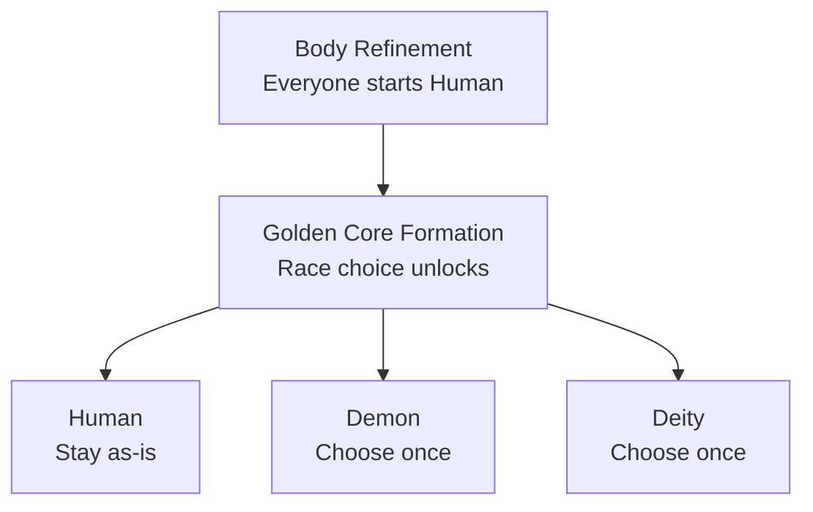

### Races

Every player starts as **Human**. Reaching **Golden Core Formation** unlocks a one-time choice to become **Demon** or **Deity** instead (or stay Human), made through a dedicated race menu (`/cultivation race`) that shows each race's live, config-driven bonuses before you pick. Used your one choice already? An admin can grant additional choices with `/cultivation admin grantracechoice`.

Each race grants its own bonuses to max health, damage, Qi gain rate, and breakthrough speed - fully rebalanceable by the server owner without recompiling (see [Config](/cultivation/config/)). Bonuses shown in-game are always live, current values, not hardcoded flavor numbers.

#### Available Races

| Race: | Unlock Realm: | Health: | Damage: | Qi Gain: | Breakthrough Speed: |
|:---|:---|:---|:---|:---|:---|
| [Human](/cultivation/races/human/) | Body Refinement | +0% | +0% | +10% | +0% |
| [Demon](/cultivation/races/demon/) | Golden Core Formation | -10% | +25% | -10% | +0% |
| [Deity](/cultivation/races/deity/) | Golden Core Formation | +20% | -10% | +5% | +20% faster |

By default, an admin using `/cultivation admin setrace` (or the admin UI's Set Race action) can bypass a race's unlock-realm requirement entirely - see `Race-Admin-Bypasses-Realm-Gate` in [Config](/cultivation/config/) to require the normal gate for admin overrides too.

Third-party mods can register brand-new races through `CultivationAPI.registerRace` - a custom race backed by its own config file (or a plain constant) shows up in the race menu right alongside Human, Demon, and Deity.
