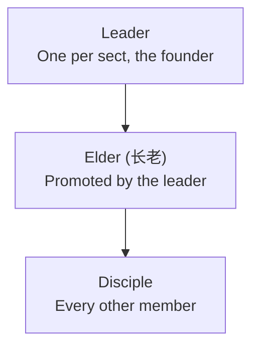

### Sects

A **Sect (宗门)** is Cultivation's guild system. Found one, gather disciples, claim a mountain of your own on a good Spirit Vein, and the whole roster cultivates faster for it. A sect that holds a hall can also carve an art into it that every disciple may wield, raise [Formations] on its ground, grow a shared Spirit Spring in the hall, and go to [war](/cultivation/wars/) over someone else's mountain.

Everything on this page is gated behind `Sects-Enabled` (default `true`). With it off, every `/sect` command refuses politely, the sect Qi bonus stops applying, and existing sect data is left on disk untouched.

 

* * *

 

#### Founding a Sect

`/sect create <name>` founds a sect with you as its leader.

- Names are 3 to 24 characters of letters, digits, spaces, hyphens and apostrophes. Anything else is refused.
- Names are unique, case-insensitively - no two sects may share one.
- You cannot found a sect while you belong to one.
- A roster holds up to 12 members including the leader (`Sect-Max-Members`).

`/sect info` (alias `i`) prints your roster, your hall, your hall's inscription and your sect's score. `/sect leave` walks away - and drops your elder rank with you, so rejoining does not silently restore your authority. A leader may not leave; they must `/sect disband`, which dissolves the sect, disperses every formation the sect controlled, drops its pending invites, and lets its hall spring be reaped.

 

* * *

 

#### Ranks: Leader, Elder, Disciple

**Elders (长老)** are the middle rank. Only the leader promotes and demotes them, from the member rows in the sect menu.

| Action: | Leader: | Elder: | Disciple: |
|:---|:---|:---|:---|
| Invite a player (`/sect invite`) | Yes | Yes | No |
| Approve or deny a join request | Yes | Yes | No |
| Set the motto | Yes | Yes | No |
| Kick a plain disciple | Yes | Yes | No |
| Kick an elder | Yes | No | No |
| Promote or demote an elder | Yes | No | No |
| Set the join policy | Yes | No | No |
| Rename the sect | Yes | No | No |
| Claim or move the hall (`/sect claim`) | Yes | No | No |
| Inscribe or scour the hall (`/sect inscribe`) | Yes | No | No |
| Declare war (`/sect war <sect>`) | Yes | No | No |
| Disband the sect | Yes | No | No |

Nobody can kick the leader, and an elder who tries to kick another elder is refused. Being kicked or leaving clears your rank and any pending join request you had.

 

* * *

 

#### Join Policies

The leader picks how outsiders get in, from the dropdown in the sect menu's **My Sect** tab. New sects start on **Invite**.

| Policy: | How a player joins: |
|:---|:---|
| **Invite** | Only by a leader or elder running `/sect invite <player>`, then the invitee running `/sect join <name>`. |
| **By Request** | The applicant queues a request from the sect menu's Browse tab; a leader or elder approves or denies it. |
| **Open** | The applicant joins instantly from the Browse tab, no approval needed. |

Notes on invites and requests:

- An invite expires after 300 seconds (`Sect-Invite-Expiry-Seconds`). Invites are held in memory only, so a server restart clears the pending ones.
- `/sect join` only ever works against a live invite. Request and Open sects are joined through the menu, not that command.
- Pending requests appear as approve/deny rows to leaders and elders in the **My Sect** tab. They persist with the sect.
- Every path re-checks the 12-member cap, and a request from someone who has since joined another sect is discarded rather than approved.

 

* * *

 

#### Motto and Renaming

A leader or elder can set a **motto** from the menu - free text, trimmed and capped at 60 characters. It shows under the sect name in the menu.

Only the leader may **rename** the sect, and the new name goes through exactly the same validation and uniqueness check as founding one. A rename carries everything keyed to the old name along with it:

- every [Formation] the sect controls, so the sect's own arrays do not suddenly treat its members as outsiders,
- the hall's shared Spirit Spring and everything banked in it (see [Cave Abodes]),
- every pending invite, so an invitee can still accept under the new name.

 

* * *

 

#### The Sect Hall

`/sect claim` claims the chunk you are standing in as the sect's hall. Only the leader may claim.

- The chunk must hold a Spirit Vein of at least tier 1 - a **rich vein** - by default (`Sect-Hall-Min-Vein-Tier`; set it to 2 to require a **dragon vein**). Ordinary chunks can never host a hall, which is what makes good veins worth fighting over.
- One hall per sect. Claiming again simply moves the hall.
- No two sects may hold the same chunk.

A claimed hall pays the whole roster a **sect Qi bonus** on Qi from every source - meditation, cores, spring collection, everything - multiplied in alongside your race, skill tree, pill and Dao multipliers:

| Hall sits on: | Qi bonus: | Config key: |
|:---|:---|:---|
| Rich vein (tier 1) | +5% | `Sect-Qi-Bonus-Percent-Rich-Hall` |
| Dragon vein (tier 2) | +8% | `Sect-Qi-Bonus-Percent-Dragon-Hall` |

A sect with no hall gets no bonus at all. Lose the hall to a siege and the bonus stops for everyone at once.

The hall also grows the sect's shared **Spirit Spring** when `Sect-Hall-Spring-Enabled` is on - it follows the hall, so moving the hall moves the spring and losing the hall hands the spring, and whatever it had banked, to the victor. See [Cave Abodes] for how springs fill and are collected.

 

* * *

 

#### Hall Inscriptions

**Hall Inscriptions (碑文)** let a sect teach one art to every disciple at once. Stand in your hall holding a technique [Manual](/cultivation/manuals/) and run `/sect inscribe`.

- Leader only, and you must be standing on the hall's own chunk - the art is carved into that ground in person.
- The manual is consumed, but only after the inscription actually takes. If the manual cannot be removed from your hands the inscription is rolled straight back rather than teaching the sect an art nobody paid for.
- Only manuals that teach a **technique** work. Skill-tree manuals grant permanent stat nodes and are refused, because a permanent node cannot be revoked when the hall falls.
- One inscription at a time. Inscribing again silently replaces what was there - the old art is simply gone.
- Running `/sect inscribe` **empty-handed scours the hall clean** instead, taking the art from every member and refunding nothing.

The inscription lives in the hall, not in anyone's head. It is resolved live on every technique check, which means:

- Every member can perform the inscribed technique without having read its manual themselves, as long as the sect holds the hall.
- The instant the sect loses the hall - captured in a siege, unclaimed, or the sect disbanded - the art vanishes from every member simultaneously, with no cleanup pass.
- The inscription itself is stored on the sect, so a sect that later claims a new hall gets its old inscription back.
- Members are reminded of the art they are borrowing when they log in, and `/sect info` only lists it while the hall is actually held.

Set `Sect-Inscription-Enabled` to `false` to switch the whole feature off; inscriptions stop teaching immediately while it is off.

 

* * *

 

#### Score and Rankings

A sect's **score** is the summed global cultivation level of every member the leaderboard has seen, where one member contributes `realm x 4 + stage + 1`. Bigger, higher-realm rosters rank higher.

`/sect top` (alias `leaderboard`) lists the top 10 sects by score with their member counts. The sect menu's **Rankings** tab shows the top 20.

 

* * *

 

#### The Sect Menu

Bare `/sect`, or `/sect menu` (alias `ui`), opens the sect menu - the graphical face of every command on this page. Three tabs:

- **My Sect** - your roster with per-member kick and promote/demote buttons, the pending join requests, the motto/rename/policy/invite controls for managers, and the claim, leave and disband actions.
- **Browse** - every sect on the server, sorted by name, with a join or request button on the ones whose policy allows it.
- **Rankings** - the top 20 sects by score.

 

* * *

 

#### Commands

| Command: | Description: | Permission: |
|:---|:---|:---|
| `/sect` | Opens the sect menu. | `cultivation.sect` |
| `/sect create <name>` | Founds a sect with you as leader. | `cultivation.sect` |
| `/sect invite <player>` | Invites a player (leader or elder). | `cultivation.sect` |
| `/sect join <sect>` | Accepts a live invite to that sect. | `cultivation.sect` |
| `/sect leave` | Leaves your sect (not the leader). | `cultivation.sect` |
| `/sect kick <player>` | Removes a member (leader or elder). | `cultivation.sect` |
| `/sect claim` | Claims the chunk you stand in as the hall (leader). | `cultivation.sect` |
| `/sect inscribe` | Carves the held technique manual into the hall, or scours it empty-handed (leader). | `cultivation.sect` |
| `/sect war [sect\|status]` | Declares a siege, or reports your current one. See [Sect Wars]. | `cultivation.sect` |
| `/sect info` | Prints your sect's roster, hall, inscription and score. | `cultivation.sect` |
| `/sect top` | Lists the top 10 sects by score. | `cultivation.sect` |
| `/sect menu` | Opens the sect menu. | `cultivation.sect` |
| `/sect disband` | Dissolves your sect (leader). | `cultivation.sect` |

`cultivation.sect` is granted to everyone by default; rank checks happen inside the sect itself, not in the permission system.

 

* * *

 

Every field named on this page - `Sect-Max-Members`, `Sect-Hall-Min-Vein-Tier`, the two Qi bonus percentages, `Sect-Invite-Expiry-Seconds` and `Sect-Inscription-Enabled` - lives in the society config; see [Society Config] for the full reference, and [Commands] for every command in the mod.

[Formation]: /cultivation/formations/
[Formations]: /cultivation/formations/
[Cave Abodes]: /cultivation/dwelling/
[Sect Wars]: /cultivation/wars/
[Society Config]: /cultivation/config/society/
[Commands]: /cultivation/commands/
