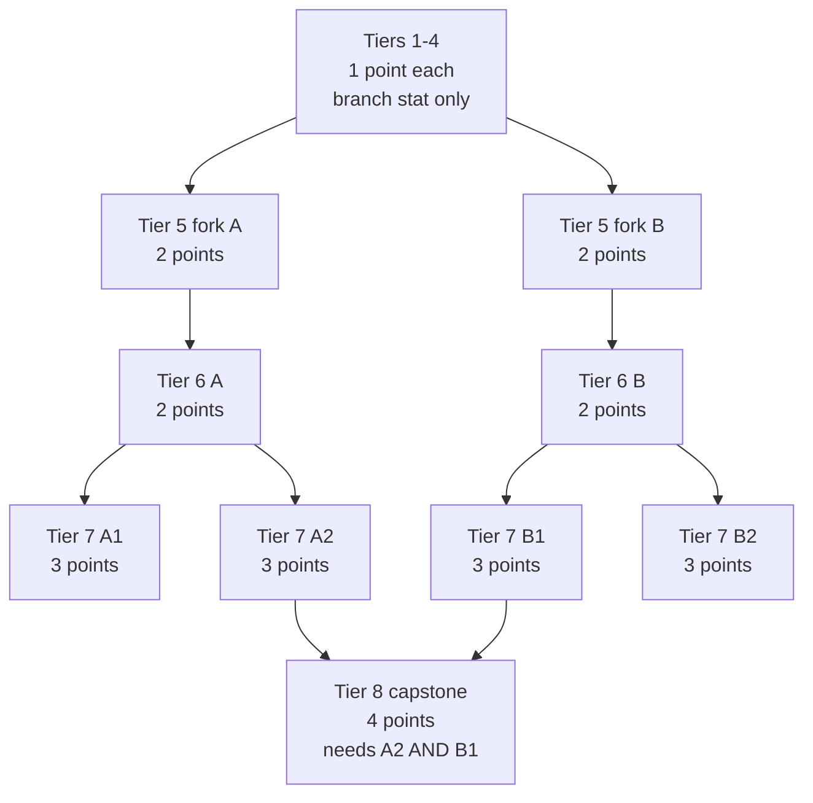

### Skill Tree

Open it with `/cultivation skilltree` (alias `skills`). The tree is a radial diagram: nine branches radiate outward from a central medallion, 40 degrees apart, and every node you unlock lights up its spoke. The canvas scrolls in both directions, so you can drag out to the rim and back.

#### Skill Points

You earn points by advancing, not by grinding:

| Variable Name: | Default Value: | Description: |
|:---|:---|:---|
| `Points-Per-Advancement` | 1 | Granted on every sub-stage advancement. |
| `Points-Per-Breakthrough` | 2 | Granted on top of the above when you break through into a new realm. |

A failed ritual demotes you a stage and revokes the points that stage granted. If you already spent them, the debt is carried until you re-earn them. Admins can hand out points directly with `/cultivation admin grantskillpoints`.

 

* * *

 

#### The Nine Branches

Each branch is dedicated to one stat. Enum order is ring order, and neighbours matter: a hybrid node borrows from the branch immediately beside it.

| Branch: | Stat: | Track: |
|:---|:---|:---|
| Vitality | Max Health | Flat |
| Resilience | Breath | Flat |
| Might | Damage % | Percent |
| Warding | Damage Reduction % | Percent |
| Insight | Qi Gain % | Percent (own track) |
| Harmony | Ritual Speed % | Percent |
| Swiftness | Movement Speed % | Percent |
| Endurance | Stamina | Flat |
| Spirit | Mana | Flat |

Health, Mana, Stamina and Breath are flat additive amounts applied through the entity stat map. The percentage stats are applied outside it: Damage % layers into your damage multiplier alongside realm and race, Qi Gain % into every Qi source, Ritual Speed % into the advancement/breakthrough/refinement duration formulas, Damage Reduction % into incoming damage alongside Life-Bound armor, and Movement Speed % directly onto your base movement speed.

 

* * *

 

#### Node Tiers and Prerequisites

Every node needs its parent unlocked first. A branch is a straight spoke to tier 4, forks in two at tier 5, forks again at tier 7, and rejoins at a single tier-8 capstone.

Tiers 1 to 4 carry one bonus, in the branch's own stat. Tiers 5, 6 and 7 are **hybrids** carrying two: the branch's own stat at the larger amount, plus a smaller borrowed amount of a neighbouring branch's stat. Fork A borrows from the branch one step counter-clockwise, fork B from the one clockwise, and tiers 6 and 7 continue their parent's exact pairing at bigger numbers.

| Tier: | Cost: | Flat primary / secondary: | Percent primary / secondary: |
|:---|:---|:---|:---|
| 1 - 4 | 1 each | 10 / 20 / 35 / 55 | 3 / 5 / 8 / 12 (Insight: 4 / 7 / 10 / 14) |
| 5 (fork) | 2 | 55 / 30 | 7 / 4 |
| 6 | 2 | 80 / 45 | 10 / 6 |
| 7 | 3 | 110 / 60 | 12 / 7 |
| 8 (capstone) | 4 | see below | see below |

Whether an amount uses the flat or percent column follows the **stat**, not the branch - a Vitality node borrowing Breath uses flat numbers for both halves, while one borrowing Might uses the percent numbers for the borrowed half.

A full branch is 13 nodes and 28 points, so all nine branches to the rim is 117 nodes and 252 points. Deep specialization is a real commitment rather than an inevitability.

 

* * *

 

#### Tier-8 Transcendence Capstones

Each branch ends in exactly one tier-8 node, back on the branch's own spoke. These are the tree's **only dual-prerequisite nodes**: you must hold both spoke-adjacent tier-7 nodes (A2 and B1), which means committing to both halves of the fork rather than picking one side and running.

Each capstone grants one of three utility stats, rotating around the ring so three branches carry each:

| Capstone Stat: | Amount: | Branches: |
|:---|:---|:---|
| Qi Cost Reduction % | +8% each | Vitality, Warding, Swiftness |
| Life-Bound XP Gain % | +25% each | Resilience, Insight, Endurance |
| Vein Drain Radius | +1 chunk ring each | Might, Harmony, Spirit |

**Qi Cost Reduction** shaves a percentage off the Qi every advancement and breakthrough requires, clamped in total by `Qi-Cost-Reduction-Cap-Percent` (40% by default) so rank-up costs cannot collapse. **Life-Bound XP Gain** multiplies the XP your [bound gear](/cultivation/lifebound/) earns. **Vein Drain Radius** widens how many rings of neighbouring chunks your meditation can draw from, on top of `Spirit-Vein-Drain-Radius-Chunks`.

 

* * *

 

#### Respec

`/cultivation respec` (aliases `resetskillpoints`, `resetskills`) clears your tree and refunds every point you spent. It is enabled by default and can be switched off with `Respec-Enabled` to make builds permanent.

Nodes taught by a [manual](/cultivation/manuals/) cost no points, so they are excluded from the refund and survive the respec intact - reading manuals cannot mint skill points, and respeccing cannot destroy a manual you already consumed.

| Command: | Description: | Permission: |
|:---|:---|:---|
| `/cultivation skilltree` | Open the radial skill tree. Alias: `skills`. | `cultivation` |
| `/cultivation respec` | Refund every spent point and clear the tree. | `cultivation` |
| `/cultivation bonuses` | List every bonus currently applying to you, skill tree included. | `cultivation` |
| `/cultivation admin grantskillpoints` | Grant a player skill points. | `cultivation` |

Point grants, the Qi cost cap and the respec toggle live in `Cultivation/SkillTreeConfig.json` - see [Cultivation Configs](/cultivation/config/cultivation/) - and every command above is on the [Commands](/cultivation/commands/) page.
