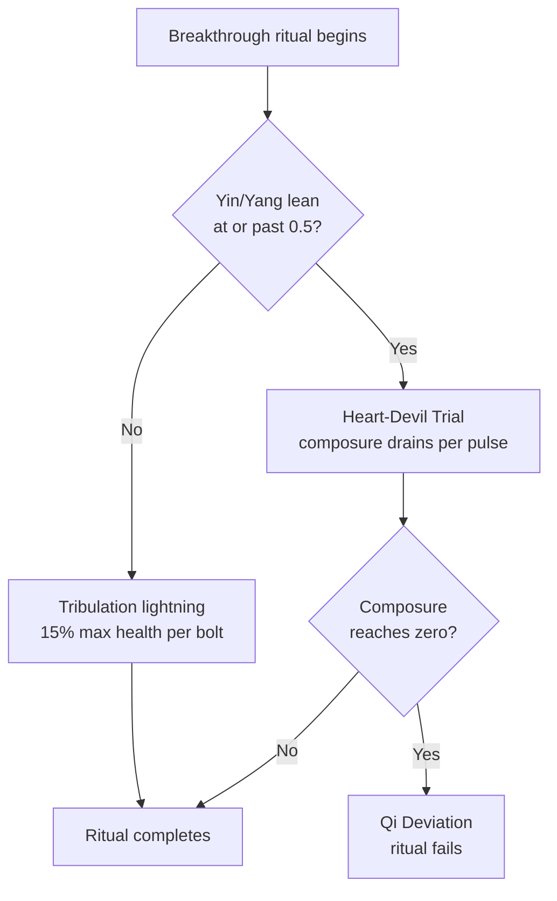

### Tribulations

The heavens do not let you ascend quietly. A realm breakthrough calls down **tribulation lightning** on the cultivator sitting through it - and a cultivator whose soul has leaned too far into darkness or light faces something worse instead.

Tribulation is on by default (`Tribulation-Enabled`) and is **lethal** by default (`Tribulation-Lethal`). A breakthrough can kill you.

 

* * *

 

#### Tribulation Lightning

| Variable Name: | Default Value: | Description: |
|:---|:---|:---|
| `Tribulation-Strike-Interval-Seconds` | 6 | Seconds of **ritual progress** between bolts. |
| `Tribulation-Damage-Percent-Of-Max-Health` | 15 | Damage per bolt, as a percentage of your max health. |
| `Tribulation-Damage-Realm-Multiplier` | 1.12 | Multiplied per realm reached. |
| `Tribulation-Lethal` | true | When false, a bolt always leaves at least a sliver of health instead of killing. |

Bolts land on ritual **progress**, not wall-clock time - a ritual paused because the chunk's Spirit Vein ran below the minimum is never struck. A 24-second first breakthrough at the defaults draws four bolts; a longer, higher-realm one draws proportionally more.

The damage is queued through the ordinary damage pipeline, so everything you have defends against it: [Life-Bound armor](/cultivation/lifebound/), the [skill tree's](/cultivation/skilltree/) Damage Reduction, Iron Body, a Qi Barrier, a Warden [beast](/cultivation/beasts/).

**Surviving a bolt pays.** Each strike you live through rolls for a [cultivation manual](/cultivation/manuals/) (`Manual-Tribulation-Drop-Chance`, 4%) and for a Spirit Stone, and burns off some of your [karma](/cultivation/karma/). Survival is judged on the following meditation tick, once the damage has fully resolved, so the survivor is simply the one still standing.

#### The Advancement Variant

Sub-stage advancements can call lightning too, but the feature is **off by default**:

| Variable Name: | Default Value: | Description: |
|:---|:---|:---|
| `Advancement-Tribulation-Enabled` | false | Turn on to make sub-stage advancements dangerous as well. |
| `Advancement-Tribulation-Damage-Percent-Of-Max-Health` | 6 | Damage per bolt, a fraction of the breakthrough figure. |

The interval, realm scaling and lethality rule are shared with breakthroughs - only the damage percentage differs.

#### Karma Makes It Worse

A cultivator carrying [karma](/cultivation/karma/) faces deeper bolts and more of them, both scaled linearly by how heavy the ledger is. The extra bolts are packed into the **same ritual duration** by compressing the interval between them, so a karma-laden breakthrough is not longer, just far busier.

#### The Tribulation Ward Pill

A banked charge from a [Tribulation Ward Pill](/cultivation/alchemy/) fully negates one bolt's damage. The bolt still falls - the light and the thunder are unchanged - it simply does not touch you. Up to three charges can be held at once, and they persist until spent.

 

* * *

 

#### The Heart-Devil Trial (心魔劫)

A cultivator whose stronger Yin or Yang lean fraction reaches `HeartDevil-Lean-Threshold` (0.5) does not face lightning at all. The heavens send an **inner demon** instead. It is enabled by default (`HeartDevil-Enabled`), and applies to breakthroughs only unless `HeartDevil-On-Advancement` is turned on.

Instead of health, the trial attacks your **composure (道心)** - a pool armed fresh at the start of each attempt and shown on the HUD while the trial runs.

| Variable Name: | Default Value: | Description: |
|:---|:---|:---|
| `HeartDevil-Lean-Threshold` | 0.5 | The lean fraction at which lightning is replaced by the trial. |
| `HeartDevil-Max-Composure` | 100 | The per-attempt pool. |
| `HeartDevil-Composure-Drain-Per-Pulse` | 34 | Drained per pulse, scaled by `0.5 + leanFraction`. |
| `HeartDevil-Debuff-Effect` | Stun | The entity effect applied on each pulse. |
| `HeartDevil-Debuff-Duration-Seconds` | 1.5 | How long that effect lasts. |

Pulses arrive on the same interval as lightning would. The drain scales with how far you have leaned, so a cultivator right at the threshold loses about 34 composure per pulse while one at a total lean loses about 51 - the deeper the soul is stained, the fewer pulses it can bear. The composure pool is per-attempt, so a failed ritual does not carry damage into the next one.

#### Qi Deviation (走火入魔)

If composure reaches zero, the ritual fails and you suffer **Qi Deviation**, announced with an on-screen title.

| Variable Name: | Default Value: | Description: |
|:---|:---|:---|
| `HeartDevil-Deviation-Demotes` | true | You drop a sub-stage. |
| `HeartDevil-Deviation-Qi-Loss-Percent` | 100 | Used instead when demotion is off - the percentage of banked Qi lost. |

Either way, the ritual ends. At the defaults a broken cultivator is demoted a stage, exactly as if they had walked away from the ritual.

#### The Clear-Mind Pill

A banked charge from a [Clear-Mind Pill](/cultivation/alchemy/) holds your composure through one pulse: the inner demon still manifests, but that pulse drains nothing. Up to three charges, persisting until used. It is the only ward that helps here - a Tribulation Ward Pill wards lightning, and a leaned cultivator never faces lightning.

 

* * *

 

#### Surviving One

The obvious answers are the right ones: bank a ward, shorten the ritual with a Clarity Pill or Ritual Speed nodes so fewer pulses land, stack incoming-damage reduction, and settle your [karma](/cultivation/karma/) before you sit down. Pulling your Yin-Yang balance back toward the middle takes you off the Heart-Devil track entirely - see [The Dao](/cultivation/dao/).

[Weapon refinement](/cultivation/refinement/) runs its own tribulation on the same interval, at a gentler 10% of max health, and it is still lethal if `Tribulation-Lethal` is on.

Every value on this page lives in the breakthrough config, alongside the ritual durations - see [Config](/cultivation/config/cultivation/) - and the related commands are on the [Commands](/cultivation/commands/) page.
