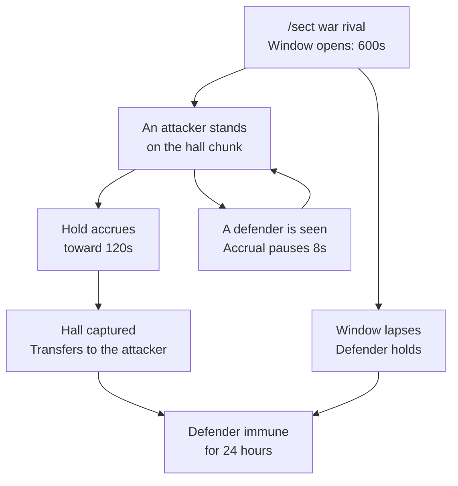

### Sect Wars

A **sect war** is one thing only: a siege of a rival [Sect]'s claimed hall. There is no score, no kill count and no capture points - an attacking sect simply has to stand on the contested chunk long enough, uncontested, before the window runs out. Win and the hall changes hands.

The whole system is gated behind `Wars-Enabled` (default `true`).

 

* * *

 

#### Declaring War

`/sect war <sect>` declares a siege on that sect's hall. Only your sect's **leader** may declare. The declaration is refused if:

| Refusal: | Reason: |
|:---|:---|
| Same sect | You cannot besiege yourself. |
| Target holds no hall | There is nothing to take. See [Sects] for how halls are claimed. |
| Target is already besieged | One siege per defender at a time. |
| You are already attacking | One siege per attacker at a time. |
| Target is on cooldown | They finished a war too recently - see below. |
| Nobody online in the target sect | Offline protection, `War-Requires-Defender-Online` (default `true`). |

Any siege whose window has already run out is swept and failed before these checks, so a forgotten siege can never lock either side out of declaring.

On success, both sects are told at once - the attackers that the siege is open, the defenders that their mountain is under threat.

 

* * *

 

#### The Siege

The rules behind that, all config-driven:

- The siege stays open for **600 seconds** from declaration (`War-Window-Seconds`). Reaching the required hold inside that window captures the hall; the window lapsing fails the siege.
- **120 seconds** of accrued hold captures it (`War-Required-Hold-Seconds`).
- Presence is sampled every 2 seconds. Hold only accrues while a member of the **attacking** sect is standing on the hall's own chunk, and no more than 5 seconds of real time may be credited from any single sample - so a gap with nobody there never counts retroactively.
- A member of the **defending** sect seen on that chunk stalls accrual for **8 seconds** afterwards (`War-Defender-Grace-Seconds`). Defenders do not have to kill anyone; simply being there is enough to hold the line.
- Both sides fight under whatever the world's normal PvP rules are. The defenders' own [Formations] help here: a Mountain-Guarding array chokes an outsider's Qi regen on their ground and an Immortal-Binding array roots and wounds intruders outright.

Sieges are persisted. A restart mid-siege resumes it with the time it had left rather than handing the defender a free win, and hold progress is flushed to disk at least every 15 seconds. A siege whose window ran out while the server was down is treated as having run its course - the defender gets their post-war immunity anyway.

 

* * *

 

#### Cooldowns

However a siege ends - captured, lapsed, or the defender's hall gone before the hold completed - the **defending sect** becomes immune to being besieged again for **24 real-world hours** (`War-Cooldown-Hours`). The attacker takes no cooldown of their own, but they cannot declare a second siege while their first is still live.

 

* * *

 

#### `/sect war status`

Bare `/sect war` and `/sect war status` both report - and **any** member may ask, not just the leader:

- Whether your sect is attacking or defending, and against whom.
- Hold accrued so far against the required hold.
- Seconds left in the window.
- Whether defenders are currently contesting the chunk, so attackers know why their hold has stopped moving.

With no siege in flight it says so, and adds the hours and minutes left on your sect's own war cooldown if it has one. Asking for status also reaps a siege whose window has quietly run out.

 

* * *

 

#### What the Winner Takes

When the hold completes, the defender's hall - the exact chunk and its vein tier - transfers to the attacking sect, and the defender is left hall-less. That single transfer carries a lot with it:

- The **sect Qi bonus** the hall paid (+5% on a rich vein, +8% on a dragon vein) moves to the victors. The losers lose theirs entirely until they claim somewhere new.
- The hall's shared **Spirit Spring**, including everything it had banked, follows the ground to the victor on the next sweep. See [Cave Abodes].
- The loser's **hall inscription** goes dark. The art it taught is revoked from every one of their members the moment the hall is gone. The inscription is not captured - it stays recorded on the losing sect and starts teaching again if they ever claim a new hall, and the victor's own inscription is untouched.
- [Formations] do **not** change hands. They are controlled by the sect that placed them, wherever they sit.

If the defending sect disbanded or gave up its hall before the hold completed, there is nothing to capture: the siege fails instead, so the attacker is at least told it is over.

 

* * *

 

#### Commands

| Command: | Description: | Permission: |
|:---|:---|:---|
| `/sect war <sect>` | Declares a siege on that sect's hall (leader only). | `cultivation.sect` |
| `/sect war status` | Reports the siege your sect is in, or your war cooldown. | `cultivation.sect` |
| `/sect claim` | Claims or moves your hall - what a siege is fought over. | `cultivation.sect` |

 

* * *

 

`Wars-Enabled`, `War-Required-Hold-Seconds`, `War-Window-Seconds`, `War-Defender-Grace-Seconds`, `War-Cooldown-Hours` and `War-Requires-Defender-Online` all live in the society config - see [Society Config] for the full reference, and [Commands] for every command in the mod.

[Sect]: /cultivation/sects/
[Sects]: /cultivation/sects/
[Formations]: /cultivation/formations/
[Cave Abodes]: /cultivation/dwelling/
[Society Config]: /cultivation/config/society/
[Commands]: /cultivation/commands/
