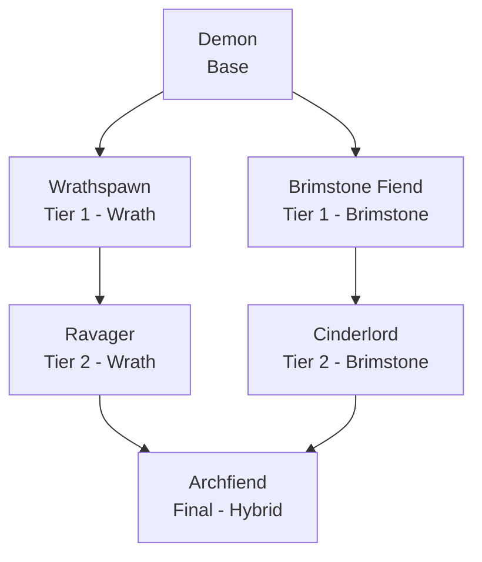

### Demon Race

**Demon Race** is a standalone [Endless Leveling] addon that adds a fiery, aggressive Demon race to the mod. Forged in brimstone and rage, the Demon burns hotter as a fight turns desperate -- it trades a caster's finesse for raw strength and ferocity, on top of the usual Endless Leveling attribute growth as you ascend. The addon requires Endless Leveling Core to be installed, and doesn't depend on the base Mermaids mod.

 

* * *

 

#### Ascension Path

Like the Endless Leveling races, the Demon ascends through a base form, two Tier 1 paths, a Tier 2 form for each path, and finally converges into a single hybrid final form.

| Race: | Stage: | Path: | Description: |
|:---|:---|:---|:---|
| Demon | Base | -- | Forged in brimstone and rage, the Demon burns hotter as a fight turns desperate, its hellborn blood shrugging off flame that would fell lesser folk. Fast and ferocious, but its rage has not yet found its full shape. |
| Wrathspawn | Tier 1 | Wrath | Given over fully to wrath, the Wrathspawn hits harder and faster the longer a fight drags on, its fury rising fastest once a foe is bloodied. |
| Brimstone Fiend | Tier 1 | Brimstone | Wreathed in living brimstone, the Brimstone Fiend wades through fire and lava alike, its hardened hide granting a patience the Wrathspawn's fury burns away. |
| Ravager | Tier 2 | Wrath | No longer merely wrathful but an engine of ruin, the Ravager tears fastest through foes already bleeding, a predator honed keenly to weakness. |
| Cinderlord | Tier 2 | Brimstone | Master of living flame, the Cinderlord strides through infernos untouched, its hardened form as much a bulwark as a weapon against the desperate and dying. |
| Archfiend | Final | Hybrid | Ascended beyond mortal demonkind, the Archfiend commands fire and fury absolute -- untouched by flame, and deadliest of all against a foe on the very edge of death. |

 

* * *

 

#### Custom Passives

Demon Race adds two brand new, exclusive passive types to Endless Leveling, alongside the standard Innate Attribute Gain shared with other race addons:

- **Hellborn** -- Grants brief immunity to fire damage (lava included) once triggered, then goes on cooldown before it can trigger again. Higher tiers grant a longer immunity window and a shorter cooldown, so Demons spend more and more of a fight fireproof the further they ascend.
- **Bloodlust** -- Grants bonus outgoing damage against a foe once its health drops below a threshold. Both the health threshold and the damage bonus grow at each tier, so higher-tier Demons trigger their bloodlust earlier and hit harder once it's active.

Both Hellborn and Bloodlust get stronger at each tier -- a base Demon has a short fire window and a modest finishing bonus compared to an Archfiend, so the race gets more dangerous the further it's leveled.

 

* * *

 

#### Race Attributes

| Race: | Life Force: | Strength: | Defense: | Haste: | Precision: | Ferocity: | Stamina: | Flow: | Sorcery: | Discipline: |
|:---|:---|:---|:---|:---|:---|:---|:---|:---|:---|:---|
| Demon | 92 | 68 | 38 | 88 | 10 | 30 | 12 | 6 | 8 | 0 |
| Wrathspawn | 108 | 86 | 42 | 98 | 11 | 40 | 14 | 6 | 8 | 0 |
| Brimstone Fiend | 128 | 74 | 58 | 86 | 10 | 32 | 20 | 6 | 9 | 0 |
| Ravager | 138 | 106 | 50 | 108 | 13 | 52 | 17 | 7 | 9 | 0 |
| Cinderlord | 168 | 90 | 74 | 96 | 12 | 42 | 26 | 7 | 10 | 0 |
| Archfiend | 325 | 130 | 92 | 118 | 16 | 62 | 30 | 9 | 12 | 0 |

 

[Endless Leveling]: https://www.curseforge.com/hytale/mods/endlessleveling
