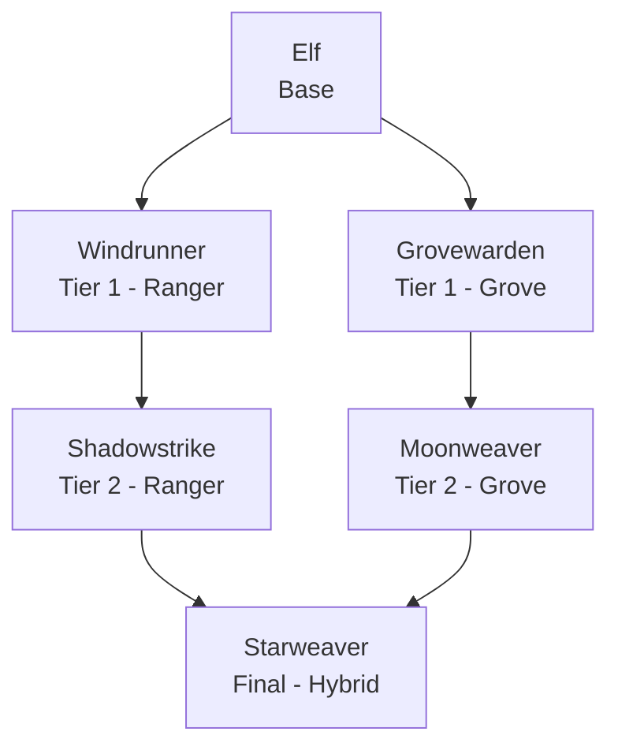

### Elf Race

**Elf Race** is a standalone [Endless Leveling] addon that adds a quick, keen-eyed Elf race to the mod. Fast of foot and sharp of eye, the Elf moves through the world with a grace few others match, splitting its long kinship with bow and grove into two very different fighting styles on top of the usual Endless Leveling attribute growth as you ascend. The addon requires Endless Leveling Core to be installed, and doesn't depend on the base Mermaids mod.

 

* * *

 

#### Ascension Path

Like the Endless Leveling races, the Elf ascends through a base form, two Tier 1 paths, a Tier 2 form for each path, and finally converges into a single hybrid final form.

| Race: | Stage: | Path: | Description: |
|:---|:---|:---|:---|
| Elf | Base | -- | Quick of foot and keen of eye, the Elf moves through the world with a grace few others match, its long kinship with bow and grove alike still unclaimed. |
| Windrunner | Tier 1 | Ranger | Faster than the eye can follow, the Windrunner closes distance and lines up a killing shot before its quarry even registers the threat. |
| Grovewarden | Tier 1 | Grove | Attuned to root and leaf, the Grovewarden channels the forest's own patience into its spellcraft, content to let a fight come to it. |
| Shadowstrike | Tier 2 | Ranger | A blur between one heartbeat and the next, the Shadowstrike is gone before retaliation ever lands, its arrows finding gaps no armor can close. |
| Moonweaver | Tier 2 | Grove | Its spellwork now bound to moon and tide, the Moonweaver bends the grove's old patience into something sharper, unhurried and inexorable. |
| Starweaver | Final | Hybrid | Having mastered both bowstring and starlight, the Starweaver moves as wind and strikes as moonlight given form -- an elf beyond what elves were thought to be. |

 

* * *

 

#### Custom Passives

Elf Race adds three brand new, exclusive passive types to Endless Leveling, alongside the standard Innate Attribute Gain shared with other race addons:

- **Toxinward** -- Reduces poison damage taken by a flat percentage, an always-on resistance rather than a triggered effect.
- **Sylvan Reflexes** -- Grants a flat chance to fully dodge an incoming physical or projectile hit, rolled on every applicable attack with no cooldown.
- **Ranger's Eye** -- Periodically scans the surrounding area for hostile creatures and reports how many are nearby and the direction of the closest one.

All three get stronger at each tier -- a base Elf has a modest dodge chance and a short-ranged Ranger's Eye compared to a Starweaver, so the race gets both safer and more perceptive the further it's leveled.

 

* * *

 

#### Race Attributes

| Race: | Life Force: | Strength: | Defense: | Haste: | Precision: | Ferocity: | Stamina: | Flow: | Sorcery: | Discipline: |
|:---|:---|:---|:---|:---|:---|:---|:---|:---|:---|:---|
| Elf | 74 | 32 | 22 | 98 | 14 | 9 | 11 | 16 | 20 | 0 |
| Windrunner | 90 | 36 | 25 | 108 | 18 | 10 | 16 | 17 | 21 | 0 |
| Grovewarden | 98 | 30 | 28 | 100 | 15 | 9 | 13 | 27 | 31 | 0 |
| Shadowstrike | 112 | 44 | 30 | 120 | 23 | 13 | 21 | 20 | 25 | 0 |
| Moonweaver | 122 | 34 | 33 | 106 | 18 | 10 | 17 | 36 | 42 | 0 |
| Starweaver | 262 | 54 | 44 | 132 | 28 | 16 | 26 | 42 | 48 | 0 |

 

[Endless Leveling]: https://www.curseforge.com/hytale/mods/endlessleveling
