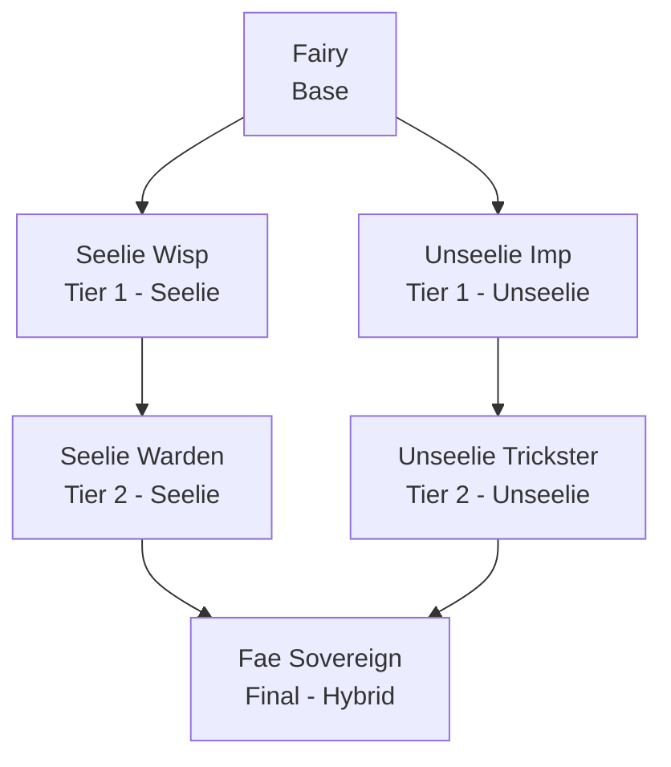

### Fairy Race

**Fairy Race** is a standalone [Endless Leveling] addon that adds a small, winged Fairy race to the mod. It's built to be light and mobile rather than a heavy hitter -- Fairies trade raw combat power for superior jumping, gliding, and fall safety, on top of the usual Endless Leveling attribute growth as you ascend. The addon requires Endless Leveling Core to be installed, and doesn't depend on the base Mermaids mod.

 

* * *

 

#### Ascension Path

Like the Endless Leveling races, the Fairy ascends through a base form, two Tier 1 courts, a Tier 2 form for each court, and finally converges into a single hybrid final form.

| Race: | Stage: | Path: | Description: |
|:---|:---|:---|:---|
| Fairy | Base | -- | A small, winged folk drawn to moonlit glades. Their innate Winged grace grants a lighter step and a slow, feather-soft fall, while Featherfall softens the landing when grace isn't enough. Quick of foot, but too frail to trade blows for long. |
| Seelie Wisp | Tier 1 | Seelie | Touched by the dawn court, the Seelie Wisp channels its Winged flight and Featherfall grace into gentle, radiant magic -- nimble overhead and generous with borrowed light. |
| Unseelie Imp | Tier 1 | Unseelie | Bound to the dusk court, the Unseelie Imp turns its Winged speed and Featherfall poise into mischief -- darting between blows before its Fae kin can react. |
| Seelie Warden | Tier 2 | Seelie | A guardian of moonlit groves, the Seelie Warden's Winged step and Featherfall landing let it weave through danger while its sorcery grows ever brighter. |
| Unseelie Trickster | Tier 2 | Unseelie | A duelist of shadow and static, the Unseelie Trickster rides its Winged haste and Featherfall recovery into every skirmish, vanishing before retaliation lands. |
| Fae Sovereign | Final | Hybrid | Having mastered both courts, the Fae Sovereign's Winged flight and Featherfall grace are near-instinctual -- a being of haste and sorcery equally at home in dawn or dusk. |

 

* * *

 

#### Custom Passives

Fairy Race adds two brand new, exclusive passive types to Endless Leveling, alongside the standard Innate Attribute Gain shared with other race addons:

- **Winged** -- Increases the Fairy's jump force, giving it a noticeably higher hop than other races. While crouching in mid-air, a Fairy also gets a boosted drag coefficient, turning a crouch-fall into a slow, controlled glide instead of a normal drop.
- **Featherfall** -- Reduces fall damage taken by a flat percentage, letting Fairies shrug off landings that would hurt other races. This stacks on top of the slow-fall glide from Winged, so higher-tier Fairies can survive drops that would otherwise be lethal.

Both Winged and Featherfall get stronger at each tier -- a base Fairy has a noticeably weaker glide and fall protection than a Fae Sovereign, so the race gets more agile the further it's leveled.

 

* * *

 

#### Race Attributes

| Race: | Life Force: | Strength: | Defense: | Haste: | Precision: | Ferocity: | Stamina: | Flow: | Sorcery: | Discipline: |
|:---|:---|:---|:---|:---|:---|:---|:---|:---|:---|:---|
| Fairy | 68 | 0 | 6 | 105 | 10 | 8 | 9 | 26 | 42 | 0 |
| Seelie Wisp | 86 | 8 | 7 | 112 | 11 | 9 | 10 | 34 | 50 | 0 |
| Unseelie Imp | 86 | 8 | 7 | 122 | 14 | 12 | 10 | 29 | 46 | 0 |
| Seelie Warden | 112 | 14 | 8 | 120 | 12 | 10 | 11 | 44 | 62 | 0 |
| Unseelie Trickster | 112 | 14 | 8 | 138 | 19 | 17 | 11 | 33 | 52 | 0 |
| Fae Sovereign | 218 | 20 | 12 | 150 | 22 | 20 | 15 | 52 | 78 | 0 |

 

[Endless Leveling]: https://www.curseforge.com/hytale/mods/endlessleveling