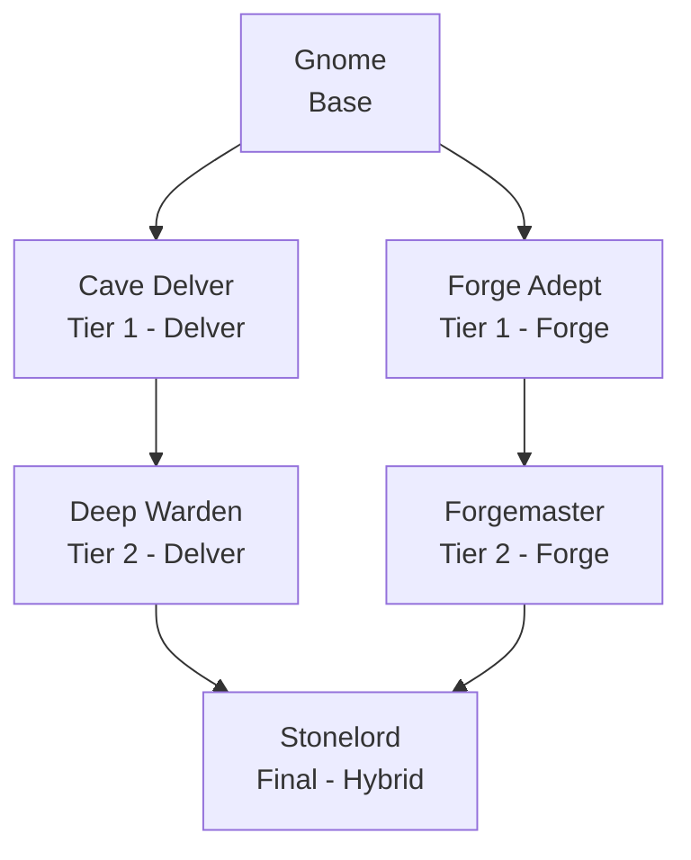

### Gnome Race

**Gnome Race** is a standalone [Endless Leveling] addon that adds a short, stone-sturdy Gnome race to the mod. It's built to be tough and immovable rather than quick -- Gnomes trade speed for a hardened hide, an innate sense for buried ore, and a hearty pool of health, on top of the usual Endless Leveling attribute growth as you ascend. The addon requires Endless Leveling Core to be installed, and doesn't depend on the base Mermaids mod.

 

* * *

 

#### Ascension Path

Like the Endless Leveling races, the Gnome ascends through a base form, two Tier 1 paths, a Tier 2 form for each path, and finally converges into a single hybrid final form.

| Race: | Stage: | Path: | Description: |
|:---|:---|:---|:---|
| Gnome | Base | -- | A short, stone-sturdy folk whose innate Stonesense feels the presence of ore through solid rock. Steady underfoot and hard to shift, though never the fastest afoot. |
| Cave Delver | Tier 1 | Delver | Having delved deep into the mountain's roots, the Cave Delver's Stonesense sharpens and its stony hide grows thicker still -- a bulwark against cave-ins and ambush alike. |
| Forge Adept | Tier 1 | Forge | Tempered at the forge, the Forge Adept channels raw strength into hammer and blade, its grip and resolve hardened by years at the anvil. |
| Deep Warden | Tier 2 | Delver | A guardian of the deepest tunnels, the Deep Warden stands immovable where lesser folk would be buried, its Stonesense reaching further than any Gnome before it. |
| Forgemaster | Tier 2 | Forge | A master of ore and flame, the Forgemaster strikes with the force of the mountain itself, its blows as unyielding as the stone it was born from. |
| Stonelord | Final | Hybrid | Having mastered both the deep tunnels and the roaring forge, the Stonelord is a living bulwark of stone and steel, sensing every vein of ore for many strides around. |

 

* * *

 

#### Custom Passives

Gnome Race adds two brand new, exclusive passive types to Endless Leveling, alongside the standard Innate Attribute Gain shared with other race addons:

- **Stonesense** -- Periodically senses nearby ore through solid rock, alerting the Gnome to what was found and its rough direction. Its range and how often it checks both improve at higher tiers.
- **Deep Roots** -- Grants bonus outgoing damage and haste while underground, rewarding Gnomes who fight from the depths they call home. Both bonuses grow at each tier.

Both Stonesense and Deep Roots get stronger at each tier -- a base Gnome has a short prospecting range and a modest underground bonus compared to a Stonelord, so the race gets more attuned to stone the further it's leveled.

 

* * *

 

#### Race Attributes

| Race: | Life Force: | Strength: | Defense: | Haste: | Precision: | Ferocity: | Stamina: | Flow: | Sorcery: | Discipline: |
|:---|:---|:---|:---|:---|:---|:---|:---|:---|:---|:---|
| Gnome | 120 | 45 | 70 | 75 | 9 | 12 | 13 | 8 | 6 | 0 |
| Cave Delver | 158 | 52 | 92 | 78 | 10 | 14 | 18 | 9 | 7 | 0 |
| Forge Adept | 154 | 62 | 82 | 82 | 11 | 18 | 15 | 8 | 6 | 0 |
| Deep Warden | 211 | 60 | 122 | 82 | 11 | 16 | 24 | 10 | 8 | 0 |
| Forgemaster | 205 | 82 | 108 | 90 | 13 | 24 | 20 | 9 | 7 | 0 |
| Stonelord | 449 | 100 | 190 | 105 | 18 | 30 | 34 | 14 | 11 | 0 |

 

[Endless Leveling]: https://www.curseforge.com/hytale/mods/endlessleveling
