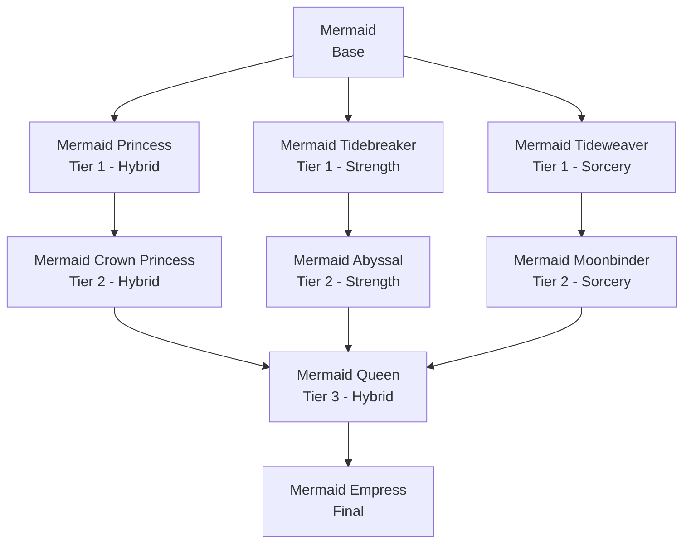
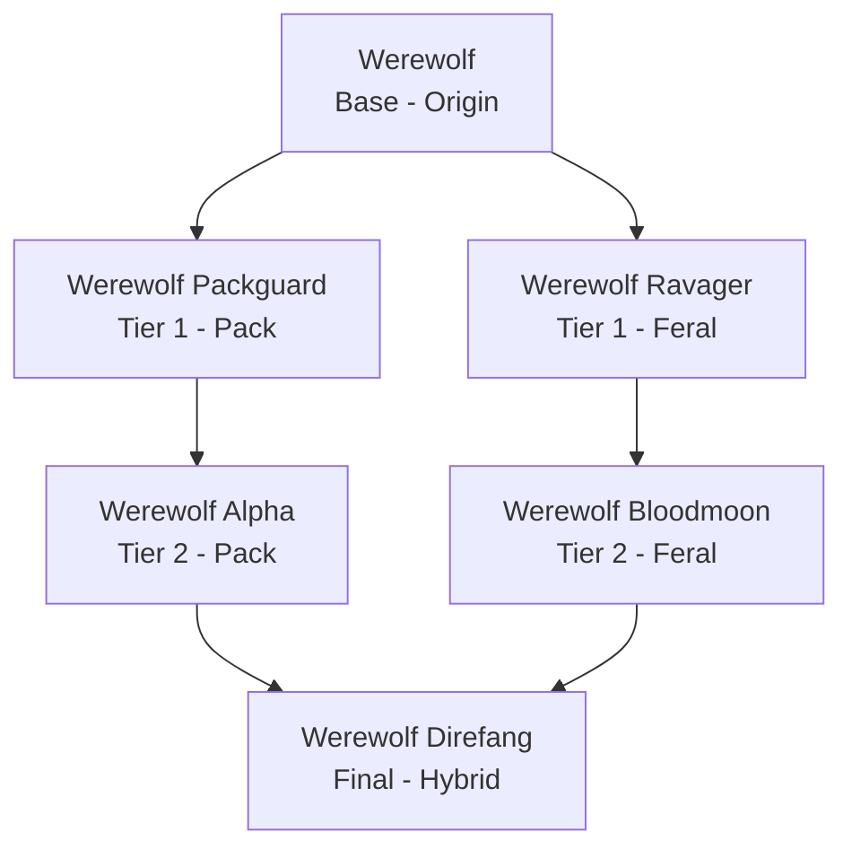
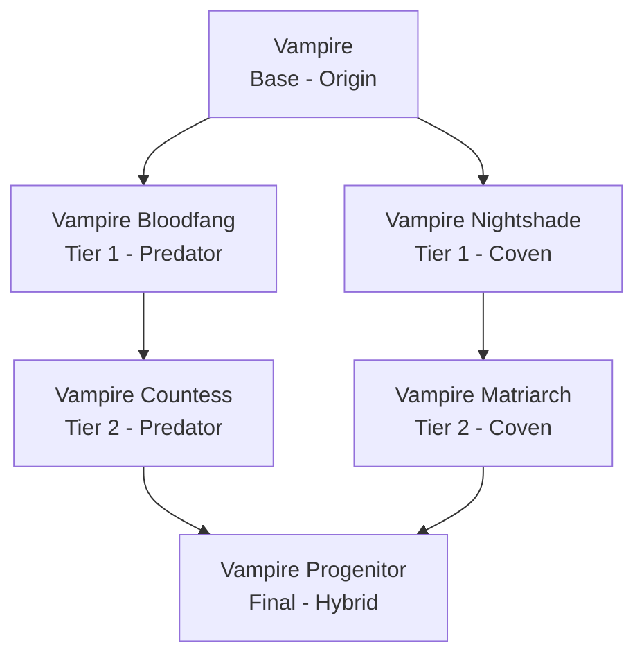

### Mermaids Premium

**Mermaids Premium** is a separate, optional addon jar that sits on top of the base Mermaids and Mythical Creatures mod, adding extra cosmetic and progression content for supporters. It requires the base Mermaids mod to be installed, and unlocks additional integration if the [Endless Leveling](https://www.curseforge.com/hytale/mods/endless-leveling) mod is also present.

#### What it adds

- Dozens of additional Mermaid tail colors, on top of the base mod's default colors.
- Full [Endless Leveling] race trees for the Mermaid, Werewolf, and Vampire, each with their own custom passives.
- Deeper hooks into Endless Leveling's ascension/prestige system, so your Mythical Creature choice actually feeds into your character build.

 

* * *

 

#### Custom Mermaid Tail Colors

The base Mermaids mod ships with a handful of tail colors. Mermaids Premium unlocks a much larger cosmetic wardrobe, letting players pick their tail color from several themed texture sets:

| Color Set: | Colors Included: | Count: |
|:---|:---|:---|
| Classic | Orange, Pink, Purple, Rose, Lime, Blue, Aqua, Cyan | 8 |
| Shiny Fabric | Red, Orange, Yellow, Lime, Green, Turquoise, Blue, Purple, Violet, Pink, Brown, White, Grey, Black | 14 |
| Fantasy Cotton | Red, Orange, Yellow, Lime, Green, Turquoise, Blue, Purple, Pink, Beige, Brown, White, Black | 13 |
| Jean | Pastel Blue, Blue, Dark Turquoise, Marine Blue, Gray Blue, Night Blue, Maroon, Light Gray, Dark Gray, Black | 10 |
| Faded Leather | Red, Orange, Orange Tan, Yellow, Lime, Green, Turquoise, Blue, Dark Blue, Purple, Violet, Brown, Dark Brown, Pink, White, Gray, Black | 17 |

That's over 60 tail color options total, selectable right from the Mermaid menu's color category once Mermaids Premium is installed, with no extra config needed.

 

* * *

 

#### Endless Leveling Integration

If the Endless Leveling mod is installed alongside Mermaids Premium, each Mythical Creature becomes a full **race line** inside Endless Leveling's ascension system, complete with its own base form, multiple ascension paths, and a final ultimate form. Progressing through a race's ascension tree is handled entirely by Endless Leveling (prestige, required skill levels, augments, etc.) -- Mermaids Premium simply provides the races and their passives.

Every race in every line also carries an **Innate Attribute Gain**, a small automatic boost to one of the character's base stats (such as Life Force) simply for being that race.

 

* * *

 

#### Custom Passives

Mermaids Premium introduces three brand new passive types into Endless Leveling, built specifically for the Mythical Creatures system. These are shared across whichever races make use of them, rather than being one-off effects:

- **Tidal Affinity** -- A Mermaid-only passive that ties combat strength to being in the water. It grants a bonus while the player is transformed into a Mermaid, and applies a small penalty while the player is untransformed on land, encouraging Mermaids to fight from the water rather than the shore.
- **Mermaid Aura** -- A supportive passive unique to the Mermaid line. While transformed, the Mermaid passively radiates an aura around themselves out to a set radius, restoring a portion of mana and stamina to anyone standing nearby -- turning a Mermaid into a bit of a support unit for their group.
- **Moonlight** -- Shared by both the Werewolf and Vampire lines, since both are creatures of the night. Grants a bonus to damage and haste, rewarding these races for fighting after dark rather than during the day.
  These three passives are configured per-race from the race's passive list, so different races along the same line can tune the strength of Tidal Affinity, Mermaid Aura, or Moonlight differently -- a higher tier race isn't guaranteed a stronger version of the passive unless its race definition says so.

 

* * *

 

##### Mermaid Race Line

| Race: | Stage: | Path: | Description: |
|:---|:---|:---|:---|
| Mermaid | Base | -- | A mythical sea creature who has the tail of a fish. |
| Mermaid Princess | Tier 1 | Hybrid | A mythical sea creature with royal blood. |
| Mermaid Tidebreaker | Tier 1 | Strength | A mythical sea creature who can break the waves. |
| Mermaid Tideweaver | Tier 1 | Sorcery | A mythical sea creature who controls attempts to control waves. |
| Mermaid Crown Princess | Tier 2 | Hybrid | A mythical sea creature with royal blood next to rule a sea. |
| Mermaid Abyssal | Tier 2 | Strength | A mythical sea creature who destroys sea creatures. |
| Mermaid Moonbinder | Tier 2 | Sorcery | A mythical sea creature who can uses the power of the moon to enchant. |
| Mermaid Queen | Tier 3 | Hybrid | A mythical sea creature who rules a sea. |
| Mermaid Empress | Final | Hybrid | The ultimate mythical sea creature who rules the seven seas. |

**Mermaid Passives:**

- **Tidal Affinity** -- Mermaids fight better in their element. Grants a combat bonus while transformed into a Mermaid, and a small penalty while untransformed on land.
- **Mermaid Aura** -- Mermaids passively radiate a supporting aura around themselves, restoring a bit of mana and stamina to those nearby within its radius.
- **Healing Bonus** -- Increases the effectiveness of healing received.
- **Innate Attribute Gain** -- A automatic passive boost to Life Force just for being a Mermaid.

##### Werewolf Race Line

| Race: | Stage: | Path: | Description: |
|:---|:---|:---|:---|
| Werewolf | Base | Origin | Cursed shapeshifters bound to primal fury and pack instinct, Werewolves hit harder the longer a fight drags on and the lower their health falls. |
| Werewolf Packguard | Tier 1 | Pack | A pack-bound protector who braces the line with thick hide and unbreakable stamina, shielding the pack from harm. |
| Werewolf Ravager | Tier 1 | Feral | A feral warrior path that pours the curse's strength into claw and fang, growing more vicious as wounds mount. |
| Werewolf Alpha | Tier 2 | Pack | The pack's iron-willed guardian, whose howl rallies allies and drags the eyes of every enemy to itself. |
| Werewolf Bloodmoon | Tier 2 | Feral | A ravening apex hunter whose rage swells with every drop of blood spilled, crippling prey beneath its claws. |
| Werewolf Direfang | Final | Hybrid | The undisputed alpha of alphas, a dire lycan whose unstoppable rage and iron hide make it a one-beast war party. |

**Werewolf Passives:**

- **Moonlight** -- Werewolves draw strength from the night, gaining a damage and haste bonus.
- **Health Regen** -- Steady passive health regeneration.
- **Berzerker** -- Deals more damage the lower the Werewolf's own health falls, rewarding fighting through the pain.
- **Retaliation** -- A chance to strike back at attackers when hit.
- **Second Wind** -- Grants a burst of recovery when things get dangerous, helping the Werewolf turn a losing fight around.
- **Primal Dominance** -- Rewards sustained aggression, growing stronger the longer a Werewolf stays on the offensive.
- **Knockback Resistance** -- Makes the Werewolf harder to stagger or knock back.
- **Innate Attribute Gain** -- An automatic passive boost to Life Force just for being a Werewolf.

##### Vampire Race Line

| Race: | Stage: | Path: | Description: |
|:---|:---|:---|:---|
| Vampire | Base | Origin | Undying predators who feed on the blood of the living, Vampires trade a fragile constitution for supernatural speed, ferocity, and the ability to steal life with every strike. |
| Vampire Bloodfang | Tier 1 | Predator | A savage predator path that channels vampiric hunger into raw strength and a bite that drains the living dry. |
| Vampire Nightshade | Tier 1 | Coven | A coven-bound blood mage who weaves sorcery through undeath, sipping mana from every kill. |
| Vampire Countess | Tier 2 | Predator | An apex huntress whose every strike compounds into a deadly rhythm of claws and stolen blood. |
| Vampire Matriarch | Tier 2 | Coven | A commanding blood sorceress who shields herself in stolen vitality while her coven's magic deepens. |
| Vampire Progenitor | Final | Hybrid | The undying first blood, a sovereign vampire who fuses predatory savagery with mastery of blood sorcery into a single, unstoppable hunger. |

**Vampire Passives:**

- **Moonlight** -- Like Werewolves, Vampires are creatures of the night and gain a damage and haste bonus from it.
- **Life Steal** -- Heals the Vampire for a portion of the damage it deals, true to its blood-drinking nature.
- **Ravenous Strike** -- Empowers the Vampire's attacks, making its bite and claw strikes hit harder.
- **Arcane Wisdom** -- Strengthens the Vampire's sorcery, feeding its blood magic through combat.
- **Innate Attribute Gain** -- An automatic passive boost to Life Force just for being a Vampire.

 

Since these races and passives are provided by Mermaids Premium but only activate through Endless Leveling, make sure both mods are installed and up to date to take advantage of them. See the [Compatibilities](/mermaids/compatibilities/) page for more on mod compatibility in general.

[Endless Leveling]: https://www.curseforge.com/hytale/mods/endless-leveling
